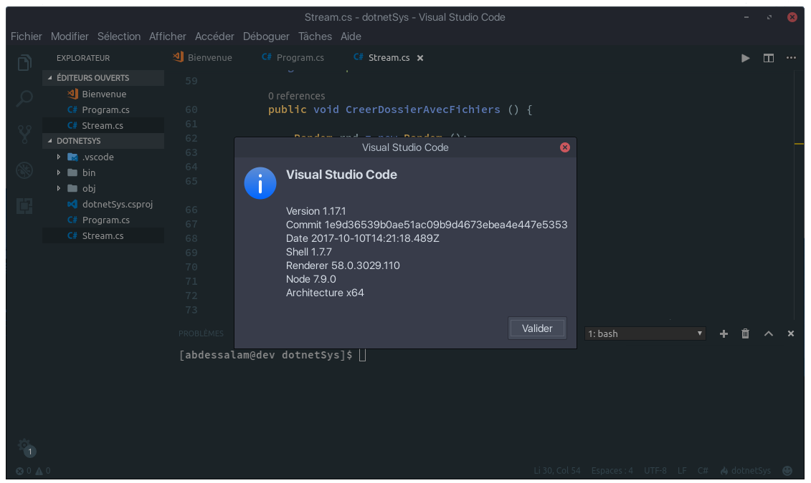

### Installation de C#/.NET sur ArchLinux ou similaire avec VScode

1. Installation de Vscode 
* Vous pouvez le télécharger directement sur le [site officiel](https://code.visualstudio.com/) en vérfiant l'extension du paquet (.deb ou .rpm)'
ou en ligne de commandes via les commandes suivantes (ArchLinux par exemple):

##### Via le lien 
* Vérifiez bien que vous pouvez lancer la commande `dpkg` si ce n'est pas le cas installer ce paquet.
* Ensuite rendez vous dans le dossier contenant le le fichier d'installation de Visual Studio Code.
* Lancer cette commande en root ``sudo dpkg -i code_1.1X.1-XXXXXXXXXX_amd64.deb``

##### Via le terminal 
* Vérifiez que vous pouvez lancer la commande ``yaourt`` si ce n'est pas le cas installez le.
* Ensuite lancez la commande ``yaourt -S visual-studio-code``

* Choisissez le numéro du paquet et commencez l'installation

### Installation de dotnet

* Lancez la commande ``yaourt -S dotnet``
* Choisissez ces paquets : 
  * ``dotnet-host``
  * ``dotnet-runtime-2.0``
  * ``dotnet-sdk-2.0``

#### Note
**Installez si nécessaite ``mono``**
  
### Plugins nécessaires
* [C# (by Omnisharp)](https://marketplace.visualstudio.com/items?itemName=ms-vscode.csharp)
* [C# FixFormat](https://marketplace.visualstudio.com/items?itemName=Leopotam.csharpfixformat)
* [Code Runner](https://marketplace.visualstudio.com/items?itemName=formulahendry.code-runner)